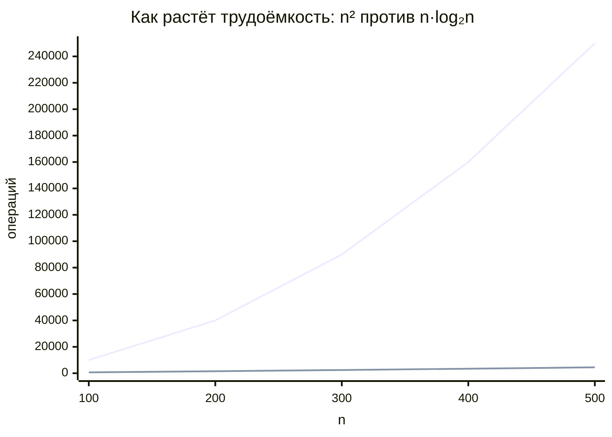

<div align="center">

# 📚 Структуры и алгоритмы обработки данных

### Лабораторные работы · 1 курс · 2 семестр


*Сортировки массивов и списков, поиск, индексация и хеширование.<br>
Алгоритмы реализованы по псевдокоду из пособия Е. В. Кураповой и Е. П. Мачикиной «Структуры и алгоритмы обработки данных» (СибГУТИ).*

</div>

---

## 🗂 Содержание

- [Структура репозитория](#-структура-репозитория)
- [Шпаргалка: все алгоритмы в одной таблице](#-шпаргалка-все-алгоритмы-в-одной-таблице)
- [Как считается трудоёмкость](#-как-считается-трудоёмкость)
- **Часть I. Квадратичные сортировки**
  - [01 · Метод прямого выбора](#01--метод-прямого-выбора-selectsort)
  - [02 · Пузырьковая сортировка](#02--пузырьковая-сортировка-bubblesort)
  - [03 · Шейкерная сортировка](#03--шейкерная-сортировка-shakersort)
  - [04 · Метод прямого включения](#04--метод-прямого-включения-insertsort)
- **Часть II. Быстрые сортировки массивов**
  - [05 · Метод Шелла](#05--метод-шелла-shellsort)
  - [06 · Пирамидальная сортировка](#06--пирамидальная-сортировка-heapsort)
  - [07 · Метод Хоара](#07--метод-хоара-quicksort)
- **Часть III. Поиск и данные произвольной структуры**
  - [08 · Сортировка записей](#08--сортировка-записей-и-поиск-по-ключу)
  - [09 · Индексные массивы](#09--индексные-массивы)
  - [10 · Двоичный поиск](#10--двоичный-поиск)
- **Часть IV. Линейные списки**
  - [11 · Стек и очередь](#11--стек-и-очередь)
  - [12 · Метод прямого слияния](#12--метод-прямого-слияния-mergesort)
  - [13 · Цифровая сортировка](#13--цифровая-сортировка-digitalsort)
- **Часть V. Хеширование**
  - [14 · Метод прямого связывания](#14--хеширование-метод-прямого-связывания)
  - [15 · Метод открытой адресации](#15--хеширование-открытая-адресация)
- [Сборка и запуск](#-сборка-и-запуск)

---

## 📁 Структура репозитория

```
Saod_1course.sem2/
├── 01-quadratic-sorts/          Часть I. Квадратичные сортировки
│   ├── 01-select-sort/          select_sort.c
│   ├── 02-bubble-sort/          bubble_sort.c
│   ├── 03-shaker-sort/          shaker_sort.c · shaker_sort_sfml.cpp
│   └── 04-insert-sort/          insert_sort.c
├── 02-advanced-sorts/           Часть II. Быстрые сортировки массивов
│   ├── 05-shell-sort/           shell_sort.c · shell_sort_v2.c
│   ├── 06-heap-sort/            heap_sort.cpp
│   └── 07-quick-sort/           quick_sort.cpp
├── 03-search/                   Часть III. Поиск и записи
│   ├── 08-struct-sort/          task1_fio.c · task2_phonebook.c
│   ├── 09-index-arrays/         index_arrays.c
│   └── 10-binary-search/        binary_search.c
├── 04-lists/                    Часть IV. Линейные списки
│   ├── 11-stack-queue/          lists.cpp
│   ├── 12-merge-sort/           merge_sort.cpp · merge_sort_lists.cpp
│   │                            merge_sort_simplified.cpp · merge_sort_compare_sfml.cpp
│   └── 13-digital-sort/         digital_sort.cpp
└── 05-hashing/                  Часть V. Хеширование
    ├── 14-hash-chaining/        hash_chaining.cpp
    └── 15-hash-open-addressing/ hash_open_addressing.cpp
```

### 📑 Задание и псевдокод по каждой работе

У каждой работы свой README по единому шаблону: **файлы → задание → псевдокод → трудоёмкость → проверка правильности**.

| № | Работа | Метод | Описание |
|---|---|---|---|
| 01 | Сортировка прямого выбора | `SelectSort` | [README](01-quadratic-sorts/01-select-sort/README.md) |
| 02 | Пузырьковая сортировка | `BubbleSort` | [README](01-quadratic-sorts/02-bubble-sort/README.md) |
| 03 | Шейкерная сортировка | `ShakerSort` | [README](01-quadratic-sorts/03-shaker-sort/README.md) |
| 04 | Сортировка прямого включения | `InsertSort` | [README](01-quadratic-sorts/04-insert-sort/README.md) |
| 05 | Метод Шелла | `ShellSort` | [README](02-advanced-sorts/05-shell-sort/README.md) |
| 06 | Пирамидальная сортировка | `HeapSort` | [README](02-advanced-sorts/06-heap-sort/README.md) |
| 07 | Быстрая сортировка | `QuickSort` | [README](02-advanced-sorts/07-quick-sort/README.md) |
| 08 | Сортировка массивов структур | `StructSort` | [README](03-search/08-struct-sort/README.md) |
| 09 | Индексация массивов | `IndexArrays` | [README](03-search/09-index-arrays/README.md) |
| 10 | Быстрый двоичный поиск | `BinarySearch` | [README](03-search/10-binary-search/README.md) |
| 11 | Стек и очередь | `StackQueue` | [README](04-lists/11-stack-queue/README.md) |
| 12 | Сортировка прямого слияния | `MergeSort` | [README](04-lists/12-merge-sort/README.md) |
| 13 | Цифровая сортировка | `DigitalSort` | [README](04-lists/13-digital-sort/README.md) |
| 14 | Хеширование: прямое связывание | `HashChaining` | [README](05-hashing/14-hash-chaining/README.md) |
| 15 | Хеширование: открытая адресация | `HashOpenAddressing` | [README](05-hashing/15-hash-open-addressing/README.md) |

---

## ⚡ Шпаргалка: все алгоритмы в одной таблице

> **Зависит от упорядоченности** означает, что трудоёмкость `M + C` заметно меняется на возрастающем, случайном и убывающем массивах.
> **Устойчивая** сортировка не меняет взаимный порядок элементов с одинаковыми ключами.

| Алгоритм | Лучший случай | Средний | Худший случай | Зависит от упорядоченности | Устойчивость | Доп. память |
|---|:---:|:---:|:---:|:---:|:---:|:---:|
| Прямой выбор | O(n²) | O(n²) | O(n²) | ❌ нет | ❌ | O(1) |
| Пузырьковая | O(n²) | O(n²) | O(n²) | ⚠️ только `M` | ✅ | O(1) |
| Шейкерная | O(n) | O(n²) | O(n²) | ✅ сильно | ✅ | O(1) |
| Прямое включение | O(n) | O(n²) | O(n²) | ✅ сильно | ✅ | O(1) |
| Шелл (шаги Кнута) | O(n log n) | ≈ O(n¹·²) | O(n¹·⁵) | ⚠️ слабо | ❌ | O(1) |
| Пирамидальная | O(n log n) | O(n log n) | O(n log n) | ❌ нет | ❌ | O(1) |
| Хоар (опорный `a[L]`) | O(n log n) | O(n log n) | O(n²) | ✅ хуже всего на упорядоченных | ❌ | O(log n)…O(n) стек |
| Прямое слияние (списки) | O(n log n) | O(n log n) | O(n log n) | ⚠️ `M` нет, `C` слабо | ✅ | O(1) на списках |
| Цифровая | O(L·(m+n)) | O(n) | O(L·(m+n)) | ❌ нет | ✅ | m очередей |
| Двоичный поиск | O(1) | O(log n) | O(log n) | нужен отсортированный массив | — | O(1) |
| Хеш: прямое связывание | O(1) | n / 2m | O(n) | ❌ нет | — | m + n указателей |
| Хеш: открытая адресация | O(1) | O(1) | O(m) | ❌ нет | — | m ячеек |



---

## 🧮 Как считается трудоёмкость

Время сортировки оценивают двумя операциями:

- **C** — число **сравнений** элементов;
- **M** — число **пересылок** (присваиваний) элементов. Один обмен `a ↔ b` стоит **3** пересылки.

Во всех лабораторных программа считает фактические `Сф` и `Мф` и сравнивает их с теоретическими формулами на трёх видах массивов: **убывающем, случайном и возрастающем**.

**Проверка правильности сортировки** выполняется двумя способами:

1. **Контрольная сумма.** Сумма элементов до и после сортировки должна совпадать, иначе элементы потерялись.
2. **Число серий.** Серия — это неубывающий участок. У массива, отсортированного по возрастанию, ровно **1** серия, у отсортированного по убыванию их **n**.

**Нижняя граница.** Любая сортировка сравнениями в среднем выполняет не меньше `log₂(n!) ≈ n·log₂n` сравнений, так что `n log n` — предел для таких методов. Цифровая сортировка обходит эту границу, потому что вообще не сравнивает элементы.

Иерархия роста: `O(1) < O(log n) < O(n) < O(n log n) < O(n²) < O(2ⁿ) < O(n!)`.

---

# Часть I. Квадратичные сортировки

## 01 · Метод прямого выбора (SelectSort)

📄 [`select_sort.c`](01-quadratic-sorts/01-select-sort/select_sort.c)

**Идея.** Найти минимум в неотсортированной части и обменять его с первым элементом этой части. Граница отсортированной части сдвигается на один шаг вправо.

```
DO i = 1 … n−1
    k ← индекс минимума среди aᵢ … aₙ
    aᵢ ↔ aₖ
OD
```

| Величина | Формула |
|---|---|
| Сравнения | `C = (n² − n) / 2` |
| Пересылки | `M = 3(n − 1)` |

- 🔹 **От упорядоченности не зависит.** `M` и `C` одинаковы даже на уже отсортированном массиве.
- 🔹 **Неустойчивая.**
- 💡 **Улучшение** (`SelectSortEnhaced`): не менять элемент сам с собой, если `k = i`. Тогда на отсортированном массиве `M = 0`.

---

## 02 · Пузырьковая сортировка (BubbleSort)

📄 [`bubble_sort.c`](01-quadratic-sorts/02-bubble-sort/bubble_sort.c)

**Идея.** Идти от конца массива к началу и менять местами соседей, если правый меньше левого. За один проход минимум «всплывает» на первое место.

```
DO i = 1 … n−1
    DO j = n, n−1 … i+1
        IF aⱼ < aⱼ₋₁ THEN aⱼ ↔ aⱼ₋₁
    OD
OD
```

| Величина | Минимум (возрастающий) | Максимум (убывающий) |
|---|:---:|:---:|
| Сравнения `C` | `(n² − n)/2` | `(n² − n)/2` |
| Пересылки `M` | `0` | `3(n² − n)/2` |

- 🔹 **Зависит от упорядоченности только через `M`.** Число сравнений постоянно.
- 🔹 **Устойчивая.** `M_ср = O(n²)`.

---

## 03 · Шейкерная сортировка (ShakerSort)

📄 [`shaker_sort.c`](01-quadratic-sorts/03-shaker-sort/shaker_sort.c) · [`shaker_sort_sfml.cpp`](01-quadratic-sorts/03-shaker-sort/shaker_sort_sfml.cpp)

**Два улучшения пузырька:**
1. Граница рабочей части ставится в **место последнего обмена**, потому что всё за ней уже отсортировано.
2. Проходы **чередуются**: справа налево, затем слева направо. Так и маленькие, и большие элементы быстро встают на места.

```
L ← 1,  R ← n,  k ← n
DO
    DO j = R … L+1:  IF aⱼ < aⱼ₋₁ THEN aⱼ ↔ aⱼ₋₁, k ← j
    L ← k
    DO j = L … R−1:  IF aⱼ > aⱼ₊₁ THEN aⱼ ↔ aⱼ₊₁, k ← j
    R ← k
OD пока L < R
```

| Величина | Минимум | Максимум |
|---|:---:|:---:|
| Сравнения `C` | `n − 1` (один проход по отсортированному) | `(n² − n)/2` |
| Пересылки `M` | `0` | `3(n² − n)/2` |

- 🔹 **Сильно зависит от упорядоченности** и по `C`, и по `M`.
- 🔹 **Устойчивая.** В среднем `O(n²)`, но сравнений меньше, чем у пузырька.

---

## 04 · Метод прямого включения (InsertSort)

📄 [`insert_sort.c`](01-quadratic-sorts/04-insert-sort/insert_sort.c)

**Идея.** Взять очередной `aᵢ` и вставить его на своё место среди уже упорядоченных `a₁ … aᵢ₋₁`, сдвигая большие элементы вправо.

```
DO i = 2 … n
    t ← aᵢ,  j ← i−1
    DO пока j > 0 и t < aⱼ
        aⱼ₊₁ ← aⱼ,  j ← j−1
    OD
    aⱼ₊₁ ← t
OD
```

| Величина | Минимум (возрастающий) | Максимум (убывающий) |
|---|:---:|:---:|
| Сравнения `C` | `n − 1` | `(n² − n)/2` |
| Пересылки `M` | `2(n − 1)` | `(n² − n)/2 + 2n − 2` |

- 🔹 **Сильно зависит от упорядоченности.** На почти отсортированном массиве работает почти линейно, поэтому метод и лежит в основе Шелла.
- 🔹 **Устойчивая.**
- 📈 В программе строится график `M + C` для выбора, пузырька, шейкера и включения (CSFML).

---

# Часть II. Быстрые сортировки массивов

## 05 · Метод Шелла (ShellSort)

📄 [`shell_sort.c`](02-advanced-sorts/05-shell-sort/shell_sort.c) · [`shell_sort_v2.c`](02-advanced-sorts/05-shell-sort/shell_sort_v2.c)

**Идея.** Включение хорошо работает на почти упорядоченных данных. Поэтому массив сначала «грубо» упорядочивают **k-сортировками**: включением сортируются подпоследовательности `aᵢ, aᵢ₊ₖ, aᵢ₊₂ₖ, …`. Шаг `k` уменьшается, а последний шаг `h₁ = 1` гарантирует полную сортировку.

```
DO k = hₘ, hₘ₋₁ … 1
    DO i = k+1 … n
        t ← aᵢ,  j ← i−k
        DO пока j > 0 и t < aⱼ
            aⱼ₊ₖ ← aⱼ,  j ← j−k
        OD
        aⱼ₊ₖ ← t
    OD
OD
```

**Шаги Кнута:** `h₁ = 1`, `hᵢ = 2·hᵢ₋₁ + 1`, количество шагов `m = ⌊log₂ n⌋ − 1`. Получается ряд 1, 3, 7, 15, 31…

| Характеристика | Значение |
|---|---|
| Средняя трудоёмкость | `≈ O(n¹·²)` при шагах Кнута |
| Зависимость от упорядоченности | ⚠️ слабая: упорядоченный массив проходится быстрее |
| Устойчивость | ❌ неустойчивая |

- 🧪 В задании 4* сравниваются разные ряды шагов: `n/2, n/4…`, ряд Кнута и ряд Токуды.

---

## 06 · Пирамидальная сортировка (HeapSort)

📄 [`heap_sort.cpp`](02-advanced-sorts/06-heap-sort/heap_sort.cpp)

**Пирамида** `(L, R)` — это последовательность, в которой `aⱼ ≤ min(a₂ⱼ, a₂ⱼ₊₁)`.

**Свойства:**
1. У пирамиды `a₁ … aₙ` первый элемент `a₁` — минимум.
2. Правая половина `a_{n/2+1} … aₙ` любого массива уже является пирамидой.

**Построение (L, R)-пирамиды** («просеивание» нового элемента `a_L`):

```
x ← a_L,  i ← L
DO
    j ← 2i
    IF j > R            THEN выход
    IF j < R и aⱼ₊₁ ≤ aⱼ THEN j ← j+1
    IF x ≤ aⱼ            THEN выход
    aᵢ ← aⱼ,  i ← j
OD
aᵢ ← x
```

**Сортировка:** сначала пирамида строится для `L = ⌊n/2⌋ … 1`, затем цикл `R = n … 2`: `a₁ ↔ a_R` и построение пирамиды `(1, R−1)`.

| Этап | Сравнения | Пересылки |
|---|---|---|
| Построение `(L, R)` | `C ≤ 2·log(R/L)` | `M ≤ log(R/L) + 2` |
| Вся сортировка | `C ≤ 2n·log n + n + 2` | `M ≤ n·log n + 6.5n − 4` |

- 🔹 **Не зависит от упорядоченности.** Значения `M + C` на убывающем, случайном и возрастающем массивах почти одинаковы.
- 🔹 **Неустойчивая.** `O(n log n)` в любом случае, без дополнительной памяти.
- ⚠️ Пирамида из пособия минимальная (min-heap), поэтому **массив получается упорядоченным по убыванию**.
- 📈 Программа сохраняет график HeapSort против ShellSort в PNG.

---

## 07 · Метод Хоара (QuickSort)

📄 [`quick_sort.cpp`](02-advanced-sorts/07-quick-sort/quick_sort.cpp)

**Идея.** Выбрать ведущий элемент `x = a_L`. Слева искать `aᵢ ≥ x`, справа искать `aⱼ ≤ x` и менять их местами, пока `i ≤ j`. Слева окажутся элементы не больше `x`, справа не меньше. Затем то же рекурсивно для каждой части.

```
Сортировка(L, R):
x ← a_L,  i ← L,  j ← R
DO пока i ≤ j
    DO пока aᵢ < x:  i ← i+1
    DO пока aⱼ > x:  j ← j−1
    IF i ≤ j THEN aᵢ ↔ aⱼ,  i ← i+1,  j ← j−1
OD
IF L < j THEN Сортировка(L, j)
IF i < R THEN Сортировка(i, R)
```

| Случай | Трудоёмкость |
|---|---|
| Худший: упорядоченный массив (прямой или обратный) | `M = 3(n − 1)`,  `C = (n² + 5n + 4)/2` → **O(n²)** |
| Лучший: ведущий элемент всегда медиана | `C = (n+1)·log(n+1) − (n+1)` |
| Средний | `C = O(n log n)`, `M = O(n log n)` |

### 🔁 Проблема глубины рекурсии

Первая версия на упорядоченном массиве уходит в рекурсию глубиной **n**, и стек может переполниться. **Вторая версия** вызывает рекурсию только для **меньшей** части, а большую обрабатывает циклом. Тогда глубина не больше **log₂ n**: для миллиона элементов это меньше 20 кадров стека.

```
DO пока L < R
    <разделение, как в версии 1>
    IF j − L > R − i THEN Сортировка(i, R),  R ← j
                     ELSE Сортировка(L, j),  L ← i
OD
```

- 🔹 **Сильно зависит от упорядоченности:** на упорядоченных массивах работает хуже всего.
- 🔹 **Неустойчивая.**
- 📈 Задание 5*: график `M + C` для QuickSort, ShellSort и HeapSort.

---

# Часть III. Поиск и данные произвольной структуры

## 08 · Сортировка записей и поиск по ключу

📄 [`task1_fio.c`](03-search/08-struct-sort/task1_fio.c) · [`task2_phonebook.c`](03-search/08-struct-sort/task2_phonebook.c)

У записей (структур) нет встроенного `<`, поэтому **операцию сравнения задают функцией** `Less(x, y)`:

- по одному ключу: `x.Name < y.Name`;
- **по нескольким ключам:** сначала сравнивается первый ключ, а при равенстве второй (фамилия → имя).

Направление сортировки меняется заменой `<` на `>` внутри функции сравнения. Пересылка записи — обычное побитовое копирование.

- `task1_fio.c`: ручная сортировка четырёх ФИО и двоичный поиск по фамилии.
- `task2_phonebook.c`: телефонный справочник, сортировка включением по «фамилия + имя» и поиск всех однофамильцев.

---

## 09 · Индексные массивы

📄 [`index_arrays.c`](03-search/09-index-arrays/index_arrays.c)

Если данные нужно быстро искать то по одному ключу, то по другому, пересортировка всего массива обходится дорого. Вместо этого строят **индексный массив** `B = (1, 2, …, n)` и сортируют **только его**, сравнивая `A[B[j]]`:

```
B ← (1, 2, …, n)
DO i = 1 … n−1
    DO j = n … i+1
        IF a[bⱼ] < a[bⱼ₋₁] THEN bⱼ ↔ bⱼ₋₁
    OD
OD
```

После этого `A[B[1]], A[B[2]], …` читаются как упорядоченная последовательность, хотя сами записи остались на месте.

**Плюсы индексации:**
1. Для одного массива можно держать **несколько индексов** (по фамилии, по телефону…).
2. Большие записи **не копируются**, индексы занимают мало места.
3. **Фильтрация:** в индекс попадают только подходящие записи (в программе, например, только гласные или только согласные).

Индекс может хранить не номера, а **указатели**. Тогда данные могут лежать где угодно в динамической памяти.

---

## 10 · Двоичный поиск

📄 [`binary_search.c`](03-search/10-binary-search/binary_search.c)

Работает **только на отсортированном массиве**. Берём средний элемент: если он равен `X`, поиск окончен; если меньше, ищем справа; если больше, ищем слева.

<table>
<tr><th>Версия 1</th><th>Версия 2</th></tr>
<tr><td>

```
L ← 1,  R ← n
DO пока L ≤ R
    m ← ⌊(L+R)/2⌋
    IF aₘ = X THEN найден, выход
    IF aₘ < X THEN L ← m+1
              ELSE R ← m−1
OD
```

</td><td>

```
L ← 1,  R ← n
DO пока L < R
    m ← ⌊(L+R)/2⌋
    IF aₘ < X THEN L ← m+1
              ELSE R ← m
OD
найден ⇔ a_R = X
```

</td></tr>
<tr><td>2 сравнения за итерацию,<br>находит <b>какой-то</b> из равных</td><td>1 сравнение за итерацию,<br>находит <b>самый левый</b> из равных</td></tr>
</table>

- Итераций не больше `⌈log₂ n⌉`, поэтому **`C = O(log n)`** у обеих версий.
- Все одинаковые ключи версия 2 находит просмотром вправо от найденного, версия 1 — просмотром в обе стороны.
- Для сравнения: линейный поиск по неупорядоченному массиву стоит `O(n)`.

---

# Часть IV. Линейные списки

## 11 · Стек и очередь

📄 [`lists.cpp`](04-lists/11-stack-queue/lists.cpp)

**Список** — последовательность элементов `tLE`, связанных полем `Next`. Доступ к элементам только последовательный.

| Структура | Добавление | Удаление | Указатели |
|---|---|---|---|
| **Стек** (LIFO) | в начало: `p→Next ← Head; Head ← p` | из начала: `p ← Head; Head ← p→Next` | `Head` |
| **Очередь** (FIFO) | в конец: `p→Next ← NIL; Tail→Next ← p; Tail ← p` | из начала | `Head`, `Tail` |

💡 **Приём `Tail ← @Head`.** Если `Next` — первое поле элемента, адрес `Head` можно считать адресом фиктивного элемента. Тогда пустая очередь задаётся как `Tail = @Head`, а добавление сводится к двум действиям без проверки на пустоту: `Tail→Next ← p; Tail ← p`.

**Перемещение элемента** из начала списка в конец очереди без копирования данных:
`Queue.Tail→Next ← List;  Queue.Tail ← List;  List ← List→Next`.

Все операции выполняются за **O(1)**. В программе также есть подсчёт контрольной суммы и серий, рекурсивная печать в прямом и обратном порядке и удаление 2-го и 4-го элементов очереди.

---

## 12 · Метод прямого слияния (MergeSort)

📄 [`merge_sort.cpp`](04-lists/12-merge-sort/merge_sort.cpp) · [`merge_sort_lists.cpp`](04-lists/12-merge-sort/merge_sort_lists.cpp) · [`merge_sort_simplified.cpp`](04-lists/12-merge-sort/merge_sort_simplified.cpp) · [`merge_sort_compare_sfml.cpp`](04-lists/12-merge-sort/merge_sort_compare_sfml.cpp)

**Слияние серий.** Две упорядоченные серии `a` (длины q) и `b` (длины r) сливаются в очередь `c`: из двух первых элементов меньший переносится в `c`, а когда одна серия закончится, остаток другой дописывается.

`min(q, r) ≤ C ≤ q + r − 1`,  `M = q + r`

**Алгоритм:**
1. **Расщепление:** элементы `S` поочерёдно раскладываются в списки `a` и `b` (заодно считается `n`).
2. Серии длины `p = 1, 2, 4, …` из `a` и `b` сливаются и **попеременно** записываются в очереди `c₀` и `c₁`.
3. `a ← c₀`, `b ← c₁`, `p ← 2p`, пока `p < n`.

```
<Расщепление(S, a, b, n)>
p ← 1
DO пока p < n
    инициализировать c₀, c₁;  i ← 0;  m ← n
    DO пока m > 0
        q ← min(p, m);  m ← m − q
        r ← min(p, m);  m ← m − r
        Слияние(a, q, b, r, cᵢ);  i ← 1 − i
    OD
    a ← c₀.Head,  b ← c₁.Head,  p ← 2p
OD
c₀.Tail→Next ← NIL;  S ← c₀.Head
```

| Величина | Формула |
|---|---|
| Сравнения | `C < n·⌈log₂ n⌉` |
| Пересылки | `M = n·⌈log₂ n⌉ + n` (ещё `n` при расщеплении) |

- 🔹 **`M` не зависит от упорядоченности, `C` зависит слабо:** на упорядоченных данных слияние заканчивается раньше.
- 🔹 **Устойчивая.** `O(n log n)` всегда. На списках дополнительная память не нужна, на массивах нужен второй массив размера `n`.
- 📈 `merge_sort_compare_sfml.cpp`: график сравнения MergeSort, HeapSort и QuickSort (SFML 3).

---

## 13 · Цифровая сортировка (DigitalSort)

📄 [`digital_sort.cpp`](04-lists/13-digital-sort/digital_sort.cpp)

**Идея.** Числа из `L` цифр в `m`-ичной системе раскладываются по `m` очередям **по последней цифре**, очереди склеиваются в список, затем то же по предпоследней цифре и так далее. Сравнений нет вообще.

Для произвольных данных каждый **байт** ключа считается цифрой (`m = 256`). Байты удобно доставать через массив `Digit`, наложенный на поле данных (`union`).

```
DO j = L, L−1 … 1
    DO i = 0 … 255:  Qᵢ.Tail ← @Qᵢ.Head
    p ← S
    DO пока p ≠ NIL
        d ← p→Digit[j]
        Q_d.Tail→Next ← p;  Q_d.Tail ← p;  p ← p→Next
    OD
    p ← @S
    DO i = 0 … 255
        IF Qᵢ.Tail ≠ @Qᵢ.Head THEN p→Next ← Qᵢ.Head;  p ← Qᵢ.Tail
    OD
    p→Next ← NIL
OD
```

| Характеристика | Значение |
|---|---|
| Трудоёмкость | `M < const · L · (m + n)` → **O(n)** при фиксированных `L` и `m` |
| Зависимость от упорядоченности | ❌ нет |
| Устойчивость | ✅ устойчивая |
| Сортировка по убыванию | склеивать очереди в обратном порядке (`255 … 0`) |

- ⚠️ При больших `L` (длинные ключи) метод может проиграть обычным сортировкам. Кроме того, он применим, только если ключ можно представить как последовательность цифр.
- 🧪 В программе: 4-байтовые и 2-байтовые целые, сортировка фамилий по байтам и график DigitalSort против `n·log n`.

---

# Часть V. Хеширование

## 14 · Хеширование: метод прямого связывания

📄 [`hash_chaining.cpp`](05-hashing/14-hash-chaining/hash_chaining.cpp)

**Хеш-функция** `H: K → A` отображает большое множество ключей (`|K| ≫ |A|`) в индексы таблицы. Ситуация `H(kᵢ) = H(kⱼ)` при `kᵢ ≠ kⱼ` называется **коллизией**. Хорошая хеш-функция вычисляется быстро и распределяет ключи равномерно.

- **Метод деления:** `H(k) = ORD(k) mod m`, где `m` лучше брать **простым**.
- **Строка** считается числом в 256-ричной системе. Благодаря свойству `(a + b) mod m = (a mod m + b mod m) mod m` хеш считается без переполнения:

```
h ← 0
DO i = 1 … t:  h ← (h·256 + Sᵢ) mod m
```

**Прямое связывание.** Для каждого индекса хранится свой список, и новый ключ добавляется **в конец** списка `H(k)`. Поиск: вычислить `H(k)` и просмотреть один список.

| Характеристика | Значение |
|---|---|
| Средняя длина списка | `n / m` |
| Среднее число сравнений при поиске | `C_ср = n / 2m` (при `n < m` обычно хватает одного сравнения) |
| Доп. память | `m + n` указателей |
| Выгоднее дерева поиска, когда | `m > n / (2·log n)` |

---

## 15 · Хеширование: открытая адресация

📄 [`hash_open_addressing.cpp`](05-hashing/15-hash-open-addressing/hash_open_addressing.cpp)

Списков нет: при коллизии ключ кладётся в **другую ячейку той же таблицы** по правилу проб `hᵢ = (h(x) + g(i)) mod m`. Пробы продолжаются, пока не найдётся ключ или пустая ячейка.

| Метод | `g(i)` | Плюсы | Минусы |
|---|---|---|---|
| **Линейные пробы** | `i` | используется вся таблица | ключи слипаются в кластеры |
| **Квадратичные пробы** | `i²` | хорошее рассеивание | просматривается не вся таблица |

**Утверждение.** Если `m` простое, квадратичные пробы проходят **не меньше половины** таблицы.

Чтобы не умножать и не делить на каждом шаге, используется рекуррентное соотношение `h₀ = h(x)`, `d₀ = 1`, `hᵢ₊₁ = hᵢ + dᵢ (mod m)`, `dᵢ₊₁ = dᵢ + 2`:

```
h ← x mod m,  d ← 1
DO
    IF a_h = x   THEN элемент найден, выход
    IF a_h = 0   THEN ячейка пуста: a_h ← x, выход
    IF d ≥ m     THEN переполнение, выход
    h ← h + d;  IF h ≥ m THEN h ← h − m
    d ← d + 2
OD
```

- 🔍 Для поиска используется тот же цикл без записи `a_h ← x`.
- 🧪 В программе число коллизий при цепочках, линейных и квадратичных пробах сравнивается для разных размеров таблицы `m`.

---

## 🌿 Ветки

Каждая работа разрабатывалась в отдельной ветке и вливалась в `main` отдельным merge-коммитом (`--no-ff`), поэтому в истории видны границы работ:

| Ветка | Содержимое |
|---|---|
| `chore/code-style` | единый стиль кода: конфигурация `.clang-format` |
| `lab/01-select-sort` | Сортировка прямого выбора |
| `lab/02-bubble-sort` | Пузырьковая сортировка |
| `lab/03-shaker-sort` | Шейкерная сортировка |
| `lab/04-insert-sort` | Сортировка прямого включения |
| `lab/05-shell-sort` | Метод Шелла |
| `lab/06-heap-sort` | Пирамидальная сортировка |
| `lab/07-quick-sort` | Быстрая сортировка |
| `lab/08-struct-sort` | Сортировка массивов структур |
| `lab/09-index-arrays` | Индексация массивов |
| `lab/10-binary-search` | Быстрый двоичный поиск |
| `lab/11-stack-queue` | Стек и очередь |
| `lab/12-merge-sort` | Сортировка прямого слияния |
| `lab/13-digital-sort` | Цифровая сортировка |
| `lab/14-hash-chaining` | Хеширование: прямое связывание |
| `lab/15-hash-open-addressing` | Хеширование: открытая адресация |
| `docs/readme` | оглавление работ и описание веток |

```bash
git log --graph --oneline --all
```

Весь код отформатирован одним `.clang-format` (LLVM, отступ 4 пробела, ширина строки 100) и не содержит комментариев: теория и псевдокод вынесены в README.

```bash
clang-format -i $(git ls-files '*.c' '*.cpp')
```

---

## 🛠 Сборка и запуск

Программы с графиками используют **SFML 3** (C++) и **CSFML** (C):

```bash
brew install sfml csfml
```

**Консольная программа на C:**

```bash
clang 03-search/10-binary-search/binary_search.c -o binary_search -lm && ./binary_search
```

**Программа на C с графиком (CSFML):**

```bash
clang -I/opt/homebrew/include 01-quadratic-sorts/04-insert-sort/insert_sort.c -o insert_sort -L/opt/homebrew/lib -lcsfml-graphics -lcsfml-window -lcsfml-system -lm && ./insert_sort
```

**Программа на C++ с графиком (SFML 3):**

```bash
clang++ -std=c++17 -I/opt/homebrew/include 02-advanced-sorts/07-quick-sort/quick_sort.cpp -o quick_sort -L/opt/homebrew/lib -lsfml-graphics -lsfml-window -lsfml-system && ./quick_sort
```

| Нужен SFML 3 | Нужен CSFML | Только стандартная библиотека |
|---|---|---|
| `shaker_sort_sfml.cpp`, `heap_sort.cpp`, `quick_sort.cpp`, `merge_sort.cpp`, `merge_sort_compare_sfml.cpp`, `digital_sort.cpp` | `shaker_sort.c`, `insert_sort.c`, `shell_sort.c` | все остальные |

---

<div align="center">

*Теория и псевдокод даны по пособию: Курапова Е. В., Мачикина Е. П. «Структуры и алгоритмы обработки данных». СибГУТИ, 2006.*

</div>
